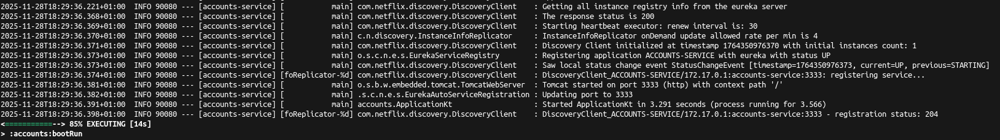
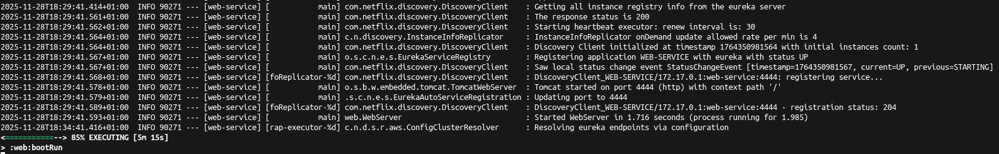
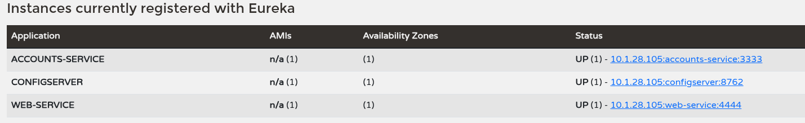
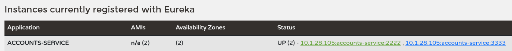
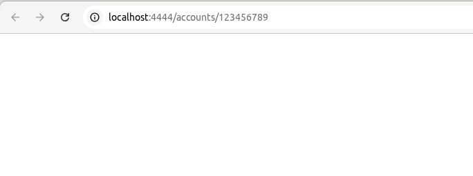
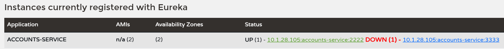
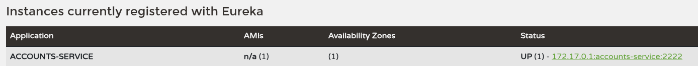

# Lab 6 Microservices - Project Report

## 1. Configuration Setup

**Configuration Repository**: https://github.com/UNIZAR-30246-WebEngineering/lab6-microservices

Describe the changes you made to the configuration:

Cambié el puerto de account de 3333 a 2222 en la tarea 4 en el fichero `accounts-service.yml`.
Gracias a la configuración externalizada, con guardar los cambios en el fichero y reiniciar el servicio Config,
fue suficiente para que los demás servicios tomaran la nueva configuración.

## 2. Service Registration (Task 1)

### Accounts Service Registration

Durante el registro, el servicio Accounts se conecta al servidor Eureka (puerto 8761) y envía una solicitud de registro
con su información (nombre, puerto, URL de salud). Eureka responde con un código 204 indicando registro exitoso.

### Web Service Registration

El servicio Web se registra con Eureka y automáticamente configura un RestTemplate que utiliza el descubrimiento de servicios. Cuando necesita llamar al servicio Accounts, consulta Eureka para obtener las instancias disponibles de ACCOUNTS-SERVICE.

## 3. Eureka Dashboard (Task 2)

Describe what the Eureka dashboard shows:

Servicios registrados: ACCOUNTS-SERVICE, WEB-SERVICE y CONFIGSERVER
Cada instancia nos proporciona la siguiente información:

- Nombre de la instancia
- Estado (UP, DOWN)
- AMIs
- Numero de servicio de cada instancia

Eureka realiza seguimiento de la salud de cada instancia mediante heartbeats

## 4. Multiple Instances (Task 4)

- Al iniciar una segunda instancia Eureka registra ambas instancias del mismo servicio con diferentes puertos (3333 y 2222).
  Si iniciamos la segunda instancia sin haber cambiado el puerto, o sin haber reiniciado el servicio Config, este no tomará
  la nueva configuración y ambas instancias estarán en el puerto 3333, lo que provocará un conflicto y no dejará lanzar la
  segunda instancia de Accounts.

- Eureka mantiene un registro de todas las instancias disponibles y proporciona esta información a los clientes que las consumen.

- Spring Cloud configura automáticamente el RestTemplate para distribuir las peticiones entre las instancias disponibles.
  En este caso cada petición se mandará a una instancia diferente de Accounts, alternando entre ambas.

## 5. Service Failure Analysis (Task 5)

### Initial Failure

Justo al detener el accounts que está en el puerto 3333. una de cada 2 peticiones a web falla, no devolviendo respuesta.
Hata que no se refresca Eureka y se elimina la instancia caída, ocurre eso, pero al poco tiempo vuelve a funcionar correctamente.

### Eureka Instance Removal

Eureka tarda unos 30 segundos en detectar y eliminar la instancia fallida, ya que al arrancar el servicio Accounts, este envía
heartbeats periódicos cada 30 segundos a Eureka. (En las capturas de la tarea 1, se puede obsevar el intervalo de 30 segundos
entre heartbeats: Starting heartbeat executor: renew interval is: 30).
Si una instancia no envía su heartbeat periódico, se marca como no disponible y eventualmente se elimina del registro.

## 6. Service Recovery Analysis (Task 6)

Answer the following questions:

- Why does the web service eventually recover?
- How long did recovery take?
- What role does client-side caching play in the recovery process?

- El servicio se recupera porque Eureka actualiza su registro y elimina la instancia caída, por lo que el cliente solo intenta conectarse
  a la instancia activa restante.
- Se recupera como máximo 30 segundos después de que la instancia falla.
- Spring Cloud mantiene un caché local de las instancias disponibles que se actualiza periódicamente, lo que afecta el tiempo de recuperación
  del cliente. Si el caché no se actualiza rápidamente, el cliente puede seguir intentando conectarse a la instancia caída
  hasta que el caché refleje el estado actualizado de Eureka.

## 7. Conclusions

- Gracias a la arquitectura de microservicios se pueden desarrollar y desplegar servicios independientemente, y varias instancias de los mismos
  servicios pueden ejecutarse simultáneamente para mejorar la disponibilidad y escalabilidad.
- Eureka facilita la comunicación dinámica entre servicios sin hardcodear las ubicaciones de los servicios, permitiendo que los servicios se
  registren y descubran automáticamente.
- Gracias a Eureka y los microservicios, si aplicamos mediante mecanismos de detección y re-ruteo de peticiones, el sistema puede recuperarse
  automáticamente de fallos de servicio, mejorando la resiliencia general del sistema.

Como aspectos a tener en cuenta que pueden comlpicar esta implementación añadiria lo siguiente:

- Seguir el orden especificado para lanzar los servicios.
- Los cambios en Eureka no son instantaneos, hay que esperar un tiempo para que se propaguen. Para evitar posibles problemas que puede causar este
  retardo, se puede configurar un sistema de retries en los clientes, de tal modo que si una petición falla, se reintente al momento en otra
  instancia disponible.

## 8. AI Disclosure

**Did you use AI tools?** Copilot, DeepSeek.

- Copilot: Autorellenado de fragmentos de texto y sugerencias de redacción.
- DeepSeek: Búsqueda de información técnica (resolución de algunas dudas respecto a alguna salida del terminal).

**Trabajo propio**
Ejecución de todos los pasos prácticos del laboratorio
Captura de todas las screenshots
Modificación de configuraciones
Pruebas de fallos y recuperación
Comprensión personal de los conceptos de microservicios
